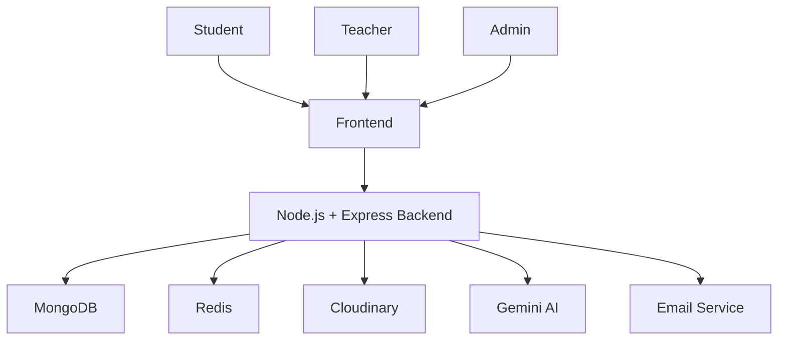
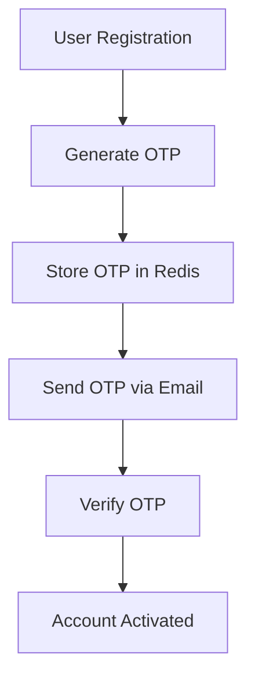
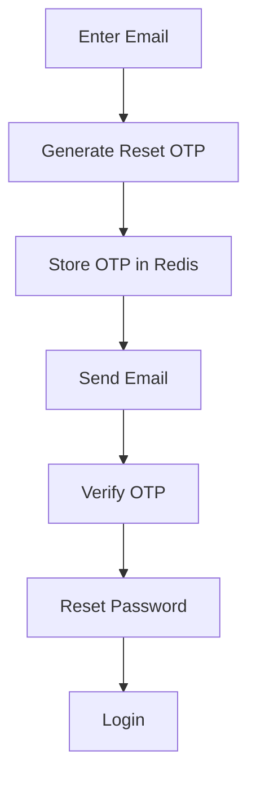
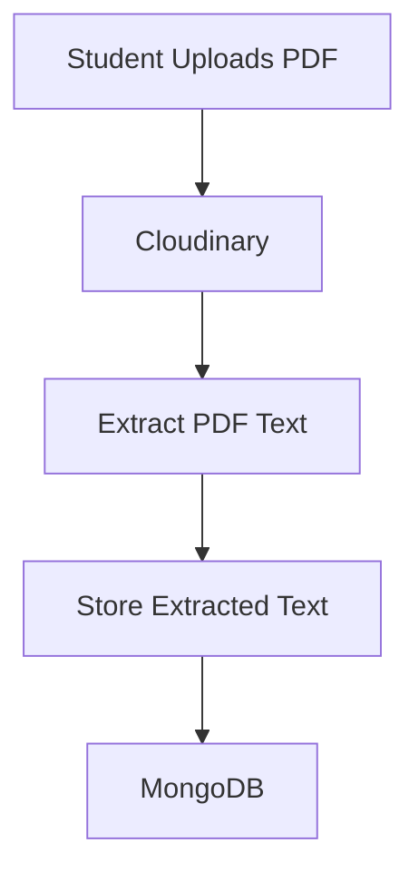
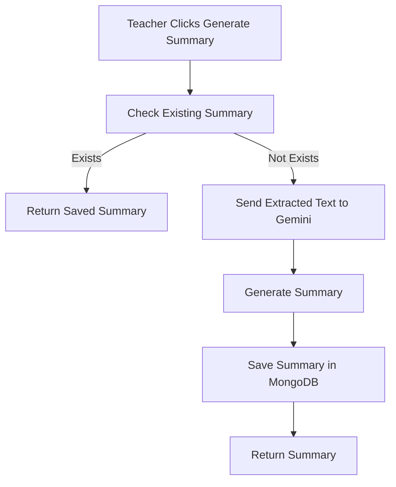
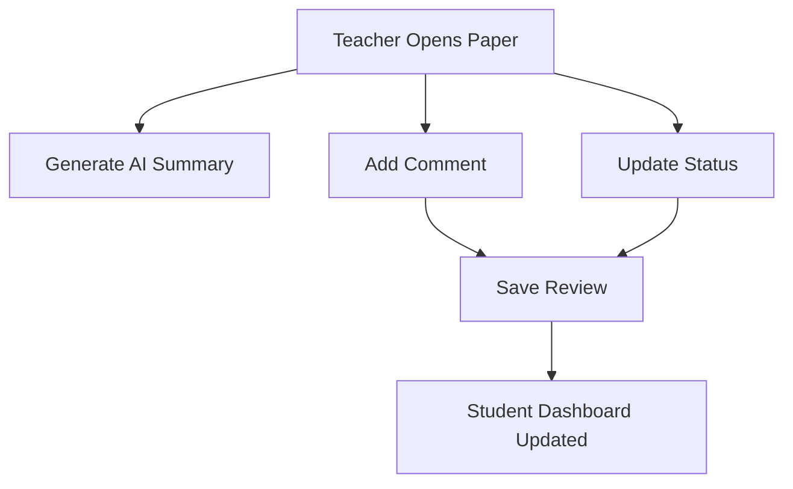

# 🚀 Enhanced Research Paper Management System

A full-stack web application designed to streamline the research paper submission, review, and management process in academic institutions.

The system provides role-based access for **Admins, Teachers, and Students**, enabling efficient paper submission, assignment, review, status tracking, authentication, and AI-powered paper summarization.

---

# 📌 Features

## 🔐 Authentication & Security

* User Registration
* OTP Email Verification
* Login & Logout
* Forgot Password
* Reset Password
* JWT Authentication
* Role-Based Authorization
* Rate Limiting
* Redis OTP Storage

---

## 👨‍💼 Admin Features

* Create Teacher Accounts
* Manage Teachers
* Manage Students
* Assign Papers to Teachers
* Monitor Paper Reviews
* Track System Activity

### Teacher Account Creation Flow

When an Admin creates a Teacher account:

1. Teacher account is created.
2. Email is sent automatically.
3. Teacher logs in using provided credentials.

---

## 👨‍🏫 Teacher Features

* View Assigned Papers
* Review Research Papers
* Add Comments
* Update Paper Status
* Generate AI Summary
* Track Reviewed Papers

### Paper Status

* Pending
* Under Review
* Accepted
* Rejected

---

## 👨‍🎓 Student Features

* Register & Verify Account
* Submit Research Papers
* View Submitted Papers
* Track Review Status
* View Teacher Comments

---

## 🤖 AI Features

### AI Summary Generation

Teachers can generate AI-powered summaries of research papers.

Generated summaries include:

* Short Summary
* Key Points
* Keywords

Powered by Google Gemini AI.

---

# 🛠️ Tech Stack

## Frontend

* HTML5
* CSS3
* JavaScript 

## Backend

* Node.js
* Express.js

## Database

* MongoDB

## Caching & OTP Storage

* Redis

## Cloud Storage

* Cloudinary

## AI Integration

* Google Gemini API

## Email Service

* Resend

---

# 🏗️ System Architecture



---

# 🔐 Authentication Flow



---

# 🔑 Forgot Password Flow



---

# 📄 Research Paper Submission Flow



---

# 🤖 AI Summary Flow



---

# 📝 Review Workflow



---

# 📂 Project Structure

```text
Frontend
│
├── admin
├── add-teacher
├── all-teachers
├── all-students
├── login
├── register
├── forgot-password
├── reset-password
├── verify-email
├── verify-otp
├── submit-paper
├── review-papers
├── reviewed-papers
├── student-dashboard
├── teacher-dashboard
├── view-paper
└── shared


Backend
│
├── controllers
├── db
├── middlewares
├── models
├── redis
├── routes
├── services
├── utils
├── validations
├── app.js
└── index.js
```

---

# 📊 Database Collections

## Users

Stores:

* Student Accounts
* Teacher Accounts
* Admin Accounts

## Papers

Stores:

* Paper Metadata
* PDF URL
* Extracted Text
* AI Summary
* Teacher Comments
* Review Status

---

# 🌟 Future Enhancements

* RAG (Retrieval Augmented Generation)
* AI Paper Question Answering
* Docker Deployment
* AWS Deployment

---

# ⚙️ Environment Variables

```env
PORT=
MONGODB_URI=
JWT_SECRET=
JWT_EXPIRY=
CLOUDINARY_CLOUD_NAME=
CLOUDINARY_API_KEY=
CLOUDINARY_API_SECRET=
REDIS_URL=
RESEND_API_KEY=
GEMINI_API_KEY=
```

---

# 🚀 Installation

```bash
git clone <repository-url>

cd project

npm install

npm run dev
```

---

# 👨‍💻 Author

Hassan Raza

BS Software Engineering

Full Stack Web Developer
AI Enthusiast
Research Paper Management System Developer

```
```
